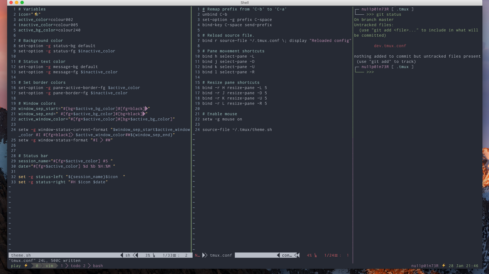

**Tmux Configurations**

The tmux configuration files along with a simple theme. The key bindings are changed for ease of use.




**Installation**

Clone the repo to `~/.tmux` folder, run the setup script by issuing the following command,

```
$ ./setup.sh
```

This will create a file `.tmux.conf` in your home directory. If there
is no such file.


**Key Bindings**

- `C-space` Prefix
- `<prefix>-j` select the down pane.
- `<prefix>-k` select the top pane.
- `<prefix>-h` select the left pane.
- `<prefix>-l` select the right pane.

Resizing the panes can be done using

- `<prefix>-J` Move the down border by 5.
- `<prefix>-K` Move the top border by 5.
- `<prefix>-h` Move the left border by 5.
- `<prefix>-l` Move the right border by 5.

Copying and pasting

- `<prefix>-Esc` Enter copy mode.
- `v`   Start selection. 
- `y` Yank selection.
- `<prefix>-p` Paste.

If you are using iterm2, check "Application in terminal may access clipboard"
to enable copying text from tmux to osX clipboard.
